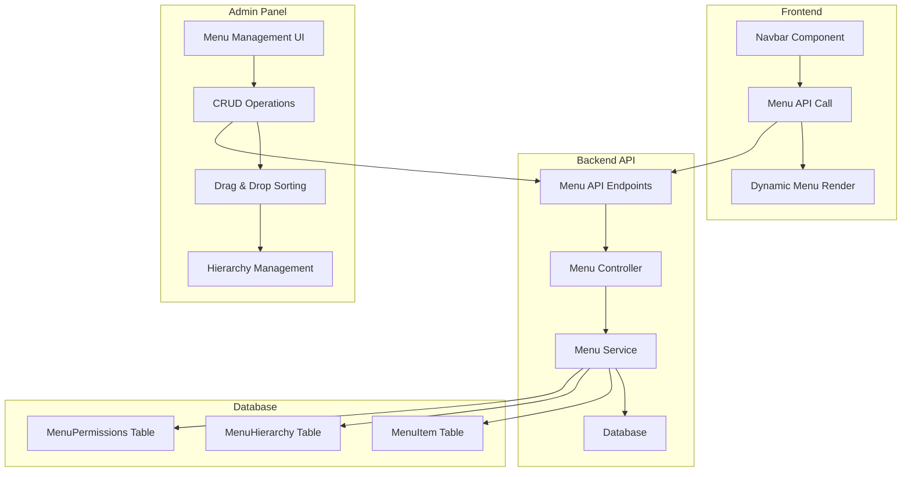

# 🎯 Menu Yönetimi Sistemi - Kapsamlı Proje Planı

## 📋 Proje Genel Bakış

**Amaç:** Frontend'deki statik navigation menüsünü dinamik, database-driven bir sisteme dönüştürmek.

**Teknoloji Stack:**
- **Backend:** Next.js 15, Prisma ORM, PostgreSQL
- **Frontend:** React, TypeScript, Tailwind CSS
- **Admin Panel:** Next.js Dashboard, Drag & Drop UI

---

## 🏗️ Sistem Mimarisi



---

## 🗄️ Database Schema Tasarımı

### SQL Schema
```sql
-- Menu Items Tablosu
CREATE TABLE menu_items (
  id VARCHAR PRIMARY KEY,
  title VARCHAR NOT NULL,
  slug VARCHAR UNIQUE,
  url VARCHAR,
  icon VARCHAR,
  description TEXT,
  is_active BOOLEAN DEFAULT true,
  is_external BOOLEAN DEFAULT false,
  target VARCHAR DEFAULT '_self',
  css_class VARCHAR,
  order_index INTEGER DEFAULT 0,
  parent_id VARCHAR REFERENCES menu_items(id),
  menu_location VARCHAR DEFAULT 'main', -- main, footer, sidebar
  created_at TIMESTAMP DEFAULT NOW(),
  updated_at TIMESTAMP DEFAULT NOW()
);

-- Menu Permissions (İleride kullanım için)
CREATE TABLE menu_permissions (
  id VARCHAR PRIMARY KEY,
  menu_item_id VARCHAR REFERENCES menu_items(id),
  role VARCHAR,
  permission VARCHAR,
  created_at TIMESTAMP DEFAULT NOW()
);
```

### Prisma Schema
```prisma
model MenuItem {
  id          String   @id @default(cuid())
  title       String
  slug        String?  @unique
  url         String?
  icon        String?
  description String?
  isActive    Boolean  @default(true)
  isExternal  Boolean  @default(false)
  target      String   @default("_self")
  cssClass    String?
  orderIndex  Int      @default(0)
  menuLocation String  @default("main")
  
  // Self-referencing relationship for hierarchy
  parentId    String?
  parent      MenuItem? @relation("MenuHierarchy", fields: [parentId], references: [id])
  children    MenuItem[] @relation("MenuHierarchy")
  
  // Permissions (future use)
  permissions MenuPermission[]
  
  createdAt   DateTime @default(now())
  updatedAt   DateTime @updatedAt
  
  @@map("menu_items")
}

model MenuPermission {
  id         String   @id @default(cuid())
  menuItemId String
  menuItem   MenuItem @relation(fields: [menuItemId], references: [id], onDelete: Cascade)
  role       String
  permission String
  createdAt  DateTime @default(now())
  
  @@map("menu_permissions")
}
```

---

## 🎯 Epic & User Stories

### Epic 1: Database & Backend API
**Süre:** 2-3 gün

#### User Stories:
1. **Database Schema Oluşturma**
   - Prisma schema tanımlama
   - Migration oluşturma
   - Seed data hazırlama

2. **API Endpoints Geliştirme**
   - GET /api/menu-items (Public)
   - GET /api/admin/menu-items (Admin)
   - POST /api/admin/menu-items (Create)
   - PUT /api/admin/menu-items/[id] (Update)
   - DELETE /api/admin/menu-items/[id] (Delete)
   - PUT /api/admin/menu-items/reorder (Sıralama)

### Epic 2: Admin Panel UI
**Süre:** 3-4 gün

#### User Stories:
1. **Menu Listesi Sayfası**
   - Tüm menu itemlarını görüntüleme
   - Hiyerarşik yapıyı gösterme
   - Aktif/pasif durumu gösterme

2. **Menu CRUD İşlemleri**
   - Yeni menu item ekleme formu
   - Mevcut menu item düzenleme
   - Menu item silme (confirmation ile)

3. **Drag & Drop Sıralama**
   - Menu itemlarını sürükle-bırak ile sıralama
   - Hiyerarşi değiştirme (parent-child)

### Epic 3: Frontend Integration
**Süre:** 2 gün

#### User Stories:
1. **Dynamic Navbar**
   - API'den menu verilerini çekme
   - Statik menu'yu dinamik hale getirme
   - Loading states ekleme

2. **Menu Caching & Performance**
   - Menu verilerini cache'leme
   - Optimistic updates

### Epic 4: Testing & Documentation
**Süre:** 1-2 gün

---

## 📝 Detaylı TODO Listesi

### 🔧 Phase 1: Backend Foundation (Gün 1-2)

#### Database & Schema
- [ ] **1.1** Prisma schema'ya MenuItem modeli ekleme
- [ ] **1.2** Migration oluşturma ve çalıştırma
- [ ] **1.3** Seed data hazırlama (mevcut menu itemları)
- [ ] **1.4** Database ilişkilerini test etme

#### API Endpoints
- [ ] **2.1** `/api/menu-items` - Public endpoint (GET)
- [ ] **2.2** `/api/admin/menu-items` - Admin CRUD endpoints
- [ ] **2.3** Menu validation schemas (Zod)
- [ ] **2.4** Error handling middleware
- [ ] **2.5** API response standardization

### 🎨 Phase 2: Admin Panel UI (Gün 3-5)

#### Menu Management Dashboard
- [ ] **3.1** Menu management sayfası oluşturma (`/dashboard/menu-management`)
- [ ] **3.2** Menu items listesi komponenti
- [ ] **3.3** Hiyerarşik tree view komponenti
- [ ] **3.4** Menu item card komponenti

#### CRUD Operations
- [ ] **4.1** "Yeni Menu Ekle" modal/form
- [ ] **4.2** Menu düzenleme formu
- [ ] **4.3** Menu silme confirmation dialog
- [ ] **4.4** Bulk operations (çoklu seçim, toplu silme)

#### Advanced Features
- [ ] **5.1** Drag & Drop sıralama (react-beautiful-dnd)
- [ ] **5.2** Parent-child ilişki yönetimi
- [ ] **5.3** Menu preview komponenti
- [ ] **5.4** Icon picker komponenti

### 🔄 Phase 3: Frontend Integration (Gün 6-7)

#### Dynamic Navigation
- [ ] **6.1** Menu API hook oluşturma (`useMenuItems`)
- [ ] **6.2** Navbar komponenti güncelleme
- [ ] **6.3** Loading ve error states
- [ ] **6.4** Menu caching (React Query/SWR)

#### Performance & UX
- [ ] **7.1** Menu preloading
- [ ] **7.2** Optimistic updates
- [ ] **7.3** Mobile menu güncelleme
- [ ] **7.4** Accessibility improvements

### 🧪 Phase 4: Testing & Quality (Gün 8)

#### Backend Tests
- [ ] **8.1** API endpoint unit tests
- [ ] **8.2** Database model tests
- [ ] **8.3** Integration tests

#### Frontend Tests
- [ ] **8.4** Component unit tests
- [ ] **8.5** Menu rendering tests
- [ ] **8.6** User interaction tests

#### Documentation
- [ ] **8.7** API documentation
- [ ] **8.8** Admin panel kullanım kılavuzu
- [ ] **8.9** Developer documentation

---

## 🔧 Teknik Detaylar

### API Endpoints Yapısı
```typescript
// Public API
GET /api/menu-items?location=main
Response: {
  success: true,
  data: MenuItem[],
  count: number
}

// Admin API
GET /api/admin/menu-items
POST /api/admin/menu-items
PUT /api/admin/menu-items/[id]
DELETE /api/admin/menu-items/[id]
PUT /api/admin/menu-items/reorder
```

### Frontend Hook Yapısı
```typescript
// useMenuItems hook
const useMenuItems = (location = 'main') => {
  const { data, error, isLoading, mutate } = useSWR(
    `/api/menu-items?location=${location}`,
    fetcher,
    { revalidateOnFocus: false }
  );

  return {
    menuItems: data?.data || [],
    isLoading,
    error,
    refresh: mutate
  };
};
```

### Menu Item Interface
```typescript
interface MenuItem {
  id: string;
  title: string;
  slug?: string;
  url?: string;
  icon?: string;
  description?: string;
  isActive: boolean;
  isExternal: boolean;
  target: string;
  cssClass?: string;
  orderIndex: number;
  menuLocation: string;
  parentId?: string;
  parent?: MenuItem;
  children?: MenuItem[];
  createdAt: Date;
  updatedAt: Date;
}
```

---

## 🎯 Sprint Planlaması (Agile)

### Sprint 1 (Gün 1-3): Foundation
**Hedef:** Temel altyapı hazır
- Database schema & migrations
- Basic API endpoints
- Admin panel temel yapısı

**Definition of Done:**
- [ ] Database tabloları oluşturuldu
- [ ] Temel CRUD API'ler çalışıyor
- [ ] Admin panel skeleton hazır

### Sprint 2 (Gün 4-6): Core Features
**Hedef:** Ana özellikler tamamlandı
- CRUD operations
- Drag & drop functionality
- Frontend integration

**Definition of Done:**
- [ ] Menu CRUD işlemleri tam çalışıyor
- [ ] Drag & drop sıralama aktif
- [ ] Frontend dinamik menu gösteriyor

### Sprint 3 (Gün 7-8): Polish & Testing
**Hedef:** Sistem production-ready
- Advanced features
- Testing
- Documentation

**Definition of Done:**
- [ ] Tüm testler geçiyor
- [ ] Documentation tamamlandı
- [ ] Performance optimizasyonları yapıldı

---

## 🧪 Test Stratejisi

### Unit Tests
- [ ] **API Endpoint Tests**
  - Menu CRUD operations
  - Validation tests
  - Error handling tests

- [ ] **Database Model Tests**
  - MenuItem model tests
  - Relationship tests
  - Constraint tests

- [ ] **Component Tests**
  - Menu list component
  - Menu form component
  - Drag & drop component

- [ ] **Hook Tests**
  - useMenuItems hook
  - Menu state management

### Integration Tests
- [ ] **Full Menu CRUD Flow**
  - Create → Read → Update → Delete
  - Parent-child relationships
  - Ordering operations

- [ ] **Frontend-Backend Integration**
  - API data fetching
  - Error state handling
  - Loading states

- [ ] **Admin Panel Workflows**
  - Menu creation workflow
  - Menu editing workflow
  - Bulk operations

### E2E Tests
- [ ] **Menu Creation Workflow**
  - Admin creates new menu item
  - Menu appears in frontend
  - Menu is functional

- [ ] **Menu Editing Workflow**
  - Admin edits menu item
  - Changes reflect in frontend
  - Validation works correctly

- [ ] **Frontend Menu Display**
  - Menu loads correctly
  - Navigation works
  - Mobile menu functions

- [ ] **Mobile Menu Functionality**
  - Mobile menu opens/closes
  - Touch interactions work
  - Responsive design correct

---

## 📊 Success Metrics

### Functionality Metrics
1. **CRUD Operations:** Tüm menu CRUD işlemleri çalışıyor ✅
2. **Hierarchy Management:** Parent-child ilişkileri doğru çalışıyor ✅
3. **Ordering:** Drag & drop sıralama smooth çalışıyor ✅
4. **Frontend Integration:** Dinamik menu doğru render ediliyor ✅

### Performance Metrics
1. **Menu Loading:** < 200ms ⚡
2. **API Response Time:** < 100ms ⚡
3. **Database Query Time:** < 50ms ⚡
4. **Frontend Render Time:** < 50ms ⚡

### Quality Metrics
1. **Test Coverage:** >80% code coverage 🧪
2. **Accessibility:** WCAG 2.1 AA compliance ♿
3. **Mobile Responsiveness:** All devices supported 📱
4. **Browser Compatibility:** Modern browsers supported 🌐

### User Experience Metrics
1. **Admin Panel Usability:** Intuitive interface ✨
2. **Error Handling:** Clear error messages 🚨
3. **Loading States:** Smooth loading experience ⏳
4. **Documentation:** Complete user guides 📚

---

## 🚀 Deployment Checklist

### Pre-Deployment
- [ ] All tests passing
- [ ] Database migrations ready
- [ ] Environment variables configured
- [ ] Performance benchmarks met

### Deployment Steps
- [ ] Run database migrations
- [ ] Deploy backend changes
- [ ] Deploy frontend changes
- [ ] Verify menu functionality
- [ ] Monitor for errors

### Post-Deployment
- [ ] Smoke tests completed
- [ ] Performance monitoring active
- [ ] User feedback collection
- [ ] Documentation updated

---

## 📚 Referanslar ve Kaynaklar

### Teknoloji Dokümantasyonları
- [Next.js Documentation](https://nextjs.org/docs)
- [Prisma Documentation](https://www.prisma.io/docs)
- [React Beautiful DnD](https://github.com/atlassian/react-beautiful-dnd)
- [SWR Documentation](https://swr.vercel.app/)

### Best Practices
- [REST API Design Guidelines](https://restfulapi.net/)
- [React Testing Best Practices](https://kentcdodds.com/blog/common-mistakes-with-react-testing-library)
- [Database Design Principles](https://www.vertabelo.com/blog/database-design-best-practices/)

---

**Proje Başlangıç Tarihi:** [TBD]
**Tahmini Tamamlanma Tarihi:** [TBD]
**Proje Sahibi:** Kent Konut Development Team
**Son Güncelleme:** $(date)
